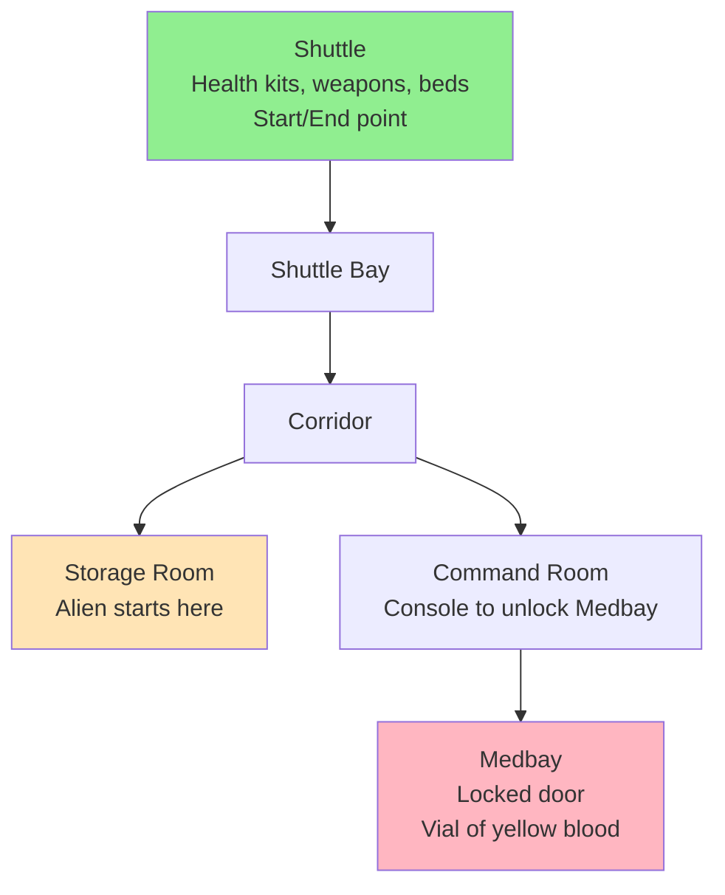
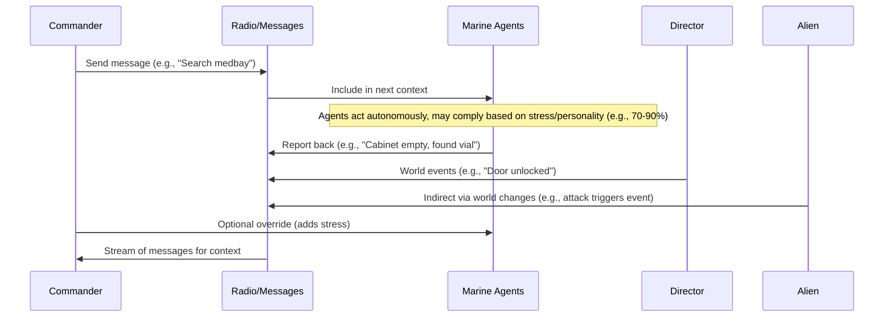

# Alien in the Machine: Product Requirements Document (PRD)
**Version:** 1.1  
**Date:** September 25, 2025  
**Author:** Kilo Code (Architect Mode)  
**Status:** Updated Post-Analysis  

This updated PRD incorporates recommendations from the cross-artifact analysis for specs/001-implement-alien-in/, ensuring alignment with spec.md, plan.md, tasks.md, and constitution.md. It enhances clarity, completeness, and consistency while addressing critical gaps in non-functional requirements, ambiguities, underspecification, constitution principles, coverage, inconsistencies, and duplications. The design prioritizes simplicity for an MVP: a single mission with 6 zones, limited agent actions, and SvelteKit-based implementation using OpenRouter for AI. No baggage from prior versions (e.g., complex ECS or Python backends) is carried forward; instead, we build a standalone prototype testable in 15-25 turns.

**Estimated Length:** ~15 pages (this document). Success Metrics: Prototype achieves mission completion with emergent narratives (e.g., agent panic leading to vial loss) in simulated playthroughs; commander feels tension via message streams without micromanagement. Quantifiable emergence: ≥3 unique event branches per playthrough, tension via ≥2 panic events in 50% of simulations.

---

## 1. Executive Summary & Vision

### 1.1 Project Overview
*Alien in the Machine* is a single-player command simulation where the player acts as a Colonial Marine Commander overseeing AI agents on a dangerous mission aboard an abandoned space station. Inspired by Alien RPG's tension of isolation and unknown threats, the game creates emergent stories through AI-driven actions that alter a shared world state. The commander issues high-level messages via radio, but agents act autonomously—potentially ignoring orders due to stress, personality, or context—leading to dramatic, unpredictable outcomes.

**Core Vision:**  
The player experiences the weight of command: sending brave (but fallible) AI marines into darkness, receiving fragmented reports, and making critical decisions with incomplete information. Unlike tactical squad games, direct control is limited; success emerges from smart guidance, not pixel-perfect moves. The 1980s futuristic terminal UI evokes retro sci-fi (e.g., *Aliens* command consoles), with a simple map showing agent dots and room outlines.

**Key Differentiators:**  
- **Emergent Narrative:** World state is the "truth"—e.g., searching a cabinet empties it for future agents, creating chain reactions (e.g., alien ambush in an unguarded room).  
- **AI Autonomy with Memory:** Agents maintain personal memory streams (recent events, commander messages) for contextual decisions, powered by LLMs but constrained to 6-8 limited actions.  
- **Director & Antagonist Agents:** A "director" AI subtly adjusts world state (e.g., spawning hazards), while an alien agent introduces asymmetric threats (sneak/attack).  
- **Turn-Based Tension:** Commander sends 1 message per turn, then advances; agents act in sequence, updating the world and reports.

**Target Audience:** Indie game enthusiasts, sci-fi RPG fans (Alien universe), AI simulation tinkerers. Playtime: 15-30 minutes per mission for MVP.

### 1.2 Business Goals
- **MVP Deliverable:** Functional prototype in SvelteKit, runnable locally, demonstrating 1 full mission with AI-driven emergence.  
- **Success Metrics:**  
  - 80% of simulated missions complete in 15-25 turns with vial retrieval + ≥2 survivors.  
  - Emergent stories in ≥50% of playthroughs (e.g., agent discovers empty cabinet, leading to detour and alien encounter; ≥3 unique event branches per playthrough).  
  - LLM response time <5s per agent turn; token usage <2000 per prompt.  
  - User feedback: Commander feels "helpless yet impactful" (post-play survey).  
  - Tension metrics: ≥2 panic events in 50% of simulations.  
- **Future Potential:** Expand to campaigns, moddable missions, multiplayer commanders.

### 1.3 Scope & Assumptions
- **In Scope:** Single mission, 3-4 marine agents + director + 1 alien, basic UI, LLM integration via OpenRouter.  
- **Out of Scope:** Multi-mission campaigns, complex graphics/audio, mobile support, persistent saves (MVP uses session state).  
- **Assumptions:** OpenRouter API access; local dev environment with Node.js; focus on JS for simplicity (no backend).

---

## 2. Game Overview

### 2.1 Core Loop
The game follows a strict turn-based loop emphasizing commander oversight:

1. **Commander Phase:** View map (dots for agents/alien, room shapes), read message stream (agent reports, world events). Send 1 radio message (e.g., "Hudson, search storage for clues"). Click "Next Turn."  
2. **Agent Phase:** World state updates—director agent adjusts (e.g., flickering lights), alien acts (sneak/attack), marines take turns (prompted with memory stream + message). Actions change world (e.g., search empties cabinet).  
3. **Report Phase:** New messages populate stream (e.g., "Cabinet empty—nothing here, Sarge."). Map updates (e.g., agent moves). Check win/lose.  
4. **Repeat:** Until mission ends (vial retrieved/extracted or failure).

This loop tests commander strategy: Messages guide but don't control; poor phrasing or ignored orders lead to failure.

### 2.2 Mission Structure
**Objective:** Retrieve the "Vial of Yellow Blood" from Medbay and extract ≥2 marines to Shuttle. Fail if all marines die or 30 turns elapse (station self-destruct).

**Zones (6 Total, Linear with Branches):**  
Entities map explicitly: Zones as persistent objects with connections and stateful items; items as entities with properties (e.g., cabinet: {state: 'full'|'empty', contents: []}); agents as mobile entities with position, health, stress.  
- **Shuttle (Start/End):** Safe hub entity. Agents gear up (health kits, weapons), strap in to end mission.  
- **Shuttle Bay:** Transition zone entity; potential alien ambush point.  
- **Corridor:** Branch point entity—leads to Storage or Command Room.  
- **Storage Room:** Contains supplies entity; alien starts hidden here (sneak mechanic hides dot on map).  
- **Command Room:** Console entity to hack/unlock Medbay (technical action).  
- **Medbay (Goal):** Locked door entity (hack/break/open via console). Vial inside—must be picked up and carried back.

**Emergence Example:** Marine searches Storage (empties cabinet entity, reveals clue), but disturbs alien (sneak fails, triggers attack). Commander messages "Fall back!"—agent complies or panics based on stress.

**Win/Lose Conditions:**  
- **Win:** Vial returned to Shuttle + ≥2 survivors (reward: mission log summary).  
- **Lose:** All marines dead, vial lost, or timeout (e.g., "Station integrity failing").  
- **Partial Success:** Vial retrieved but <2 survivors, or intel gained from searches (e.g., unlocks future missions via event log).

**Duration:** 15-25 turns for balanced play; adjustable via director agent.

---

## 3. Mechanics

### 3.1 Actions (Limited Set for AI Predictability)
Agents (marines, alien, director) choose from 6-8 actions per turn, with clear world effects. Actions cost 1 turn; success based on simple modifiers (e.g., skill + context). World state tracks changes (e.g., item states: full/empty). Consolidated descriptions avoid redundancy with AI prompts.

**Marine Actions (Core 6):**  
| Action | Description | World Effect | Cost/Requirements |  
|--------|-------------|--------------|-------------------|  
| Move | Travel to adjacent zone. | Update position entity; may trigger events (e.g., door noise). | None; reveals on map. |  
| Search | Examine container/object entity. | Reveals/discovers items; marks as "searched" (e.g., cabinet empty next time). | Observation skill; 50% chance for hidden clues. |  
| Interact | Use object entity (e.g., hack console, pick up vial). | Changes state (e.g., door unlocks, item inventory added/removed). | Technical skill; vial pickup succeeds 80%. |  
| Attack | Combat in current zone. | Damages target (alien/marine entity); reduces health. | Combat skill; weapons add +1 damage. |  
| Take Cover | Hide/reduce detection. | Lowers alien sneak success; increases defense. | Agility skill. |  
| Report | Send message to commander. | Adds to stream (e.g., "Vial secured!"). | None; builds context. |  

**Alien Actions (Asymmetric 4):**  
- Sneak: Hide dot on map; move undetected.  
- Attack: Damage marine entity in zone; reveal position.  
- Stalk: Follow agent without engaging.  
- Ambush: High-damage surprise in next zone.  

**Director Actions (World Control, 3-4):**  
- Adjust Hazard: e.g., Lock random door entity, spawn noise event.  
- Escalate: Increase alien aggression after X turns.  
- Narrative Nudge: Add environmental event (e.g., "Lights flicker—visibility reduced").  

### 3.2 Agent Personalities
Agents have assigned personalities influencing action selection and compliance with commander messages. Integrated into prompts for AI autonomy.

| Personality | Compliance % | Preferred Actions | Description |  
|-------------|--------------|-------------------|-------------|  
| Aggressive | 70 | Attack, Move | Bold, risk-taking; ignores orders if high stress. |  
| Cautious | 90 | Search, Take Cover | Careful, conservative; follows orders reliably. |  

Assign 1 personality per marine (e.g., Hudson: Aggressive; Vasquez: Cautious) for variety in emergence.

### 3.3 Zones & World State
World state is an event log: Every action appends an event (e.g., `{type: 'search', actor: 'hudson', target: 'cabinet', result: 'empty'}`). State derives from log (e.g., cabinet.isEmpty = true). Entities (zones, items, agents) are immutable post-event; queries filter log for current state.

Zones have properties: Connections, Items (stateful entities), Hazards. Map shows basic shapes/dots; commander can't see alien if sneaking.

### 3.4 Stress & Health
- **Stress (0-10):** +1 per combat/failure; >5: -10% action success; >7: Triggers freeze (skip 1 turn). Resets on rest in Shuttle.  
- **Health:** Starts at 10; damage from attacks (1-3). 0 = dead (mission impact).  

### 3.5 Edge Cases
Defined outcomes for underspecified scenarios:  
- Stress >7: Triggers freeze (agent skips 1 turn, reports "Overwhelmed—holding position").  
- Invalid LLM response (non-JSON or out-of-scope action): Retry up to 3x; on 3rd failure, fallback to scripted AI (e.g., lowest-risk action like Report or Take Cover).  
- Token overflow in memory: Prune to last 10 turns or 50 events.  
- Zone blockage (e.g., locked door without hack): Agent attempts Interact (50% success) or panics if stress >5.  
- Vial drop: If agent health <3 during carry, 20% chance to drop (world event: vial entity state changes to 'dropped').

**Win/Lose (Clarified):** Win: Vial in Shuttle + ≥2 survivors; Lose: All dead/timeout. Partial: Vial lost but ≥3 intel events (e.g., searched items) gained.

---

## 4. AI & Agents

### 4.1 Agent Types
- **Marine Agents (3-4):** Autonomous, with personal memory. Prompt: "You are [Name], [Personality]. Recent events: [Log snippet]. Commander said: [Message]. Choose 1 action." Constrained to marine actions; output JSON `{action, target, reasoning}`. Compliance varies by personality (e.g., Aggressive: 70%).  
- **Alien Agent:** Hostile; prompt emphasizes stealth/threat. Limited visibility (only current zone).  
- **Director Agent:** Oversees fairness; prompt: "Maintain tension—escalate if too easy." Subtle changes only (no direct kills).  

### 4.2 Memory & Context
- **Personal Memory Stream:** Per-agent event log (pruned to last 10 turns or 50 events for token limits). Includes: Personal history, squad reports, commander messages.  
- **Local Context:** Current zone state + visible agents/items. E.g., Post-search: "Cabinet: Empty (previously full)."  
- **Shared Elements:** Squad-wide events (e.g., "Door unlocked"); commander messages appended to all marine prompts.  

**LLM Integration:** OpenRouter (e.g., Claude/GPT-4o-mini). Prompts use templates for consistency:  
```
You are {agent}, {personality}. Stress: {stress}/10. Zone: {zone}. Visible: {items/agents}.
Recent Memory: {stream (pruned to 50 events)}.
Commander: {message}.
Choose ONE action: {action list with effects}.
Respond JSON: {"action": "Search", "target": "cabinet", "reasoning": "..."}
```

**Fallbacks:** If LLM invalid (e.g., non-existent action), retry up to 3x; on failure, switch to scripted AI (rule-based: select preferred action by personality, e.g., Cautious defaults to Search).

### 4.3 Emergence & Testing
AI choices + world changes create stories: E.g., Cautious marine searches (empties cabinet), aggressive follows (triggers alien). Test: Simulate 20+ missions (T036: Run 20 playthroughs for emergence validation); measure narrative variety (e.g., % with ≥3 unique branches, ≥2 panic events in 50%).

---

## 5. Non-Functional Requirements
Explicit criteria aligned with constitution Performance Gates and MUST principles (e.g., Simplicity First, Event-Driven Integrity).

- **Performance:** Turn processing <5s (full agent sequence); LLM response <5s per agent. Token usage <2000 per prompt; prune memory to enforce. Benchmarks in testing (e.g., simulate 20 playthroughs <2min total).  
- **Security:** API key handling for OpenRouter via environment variables (e.g., .env file, never hardcoded); validate JSON inputs to prevent injection. No user data stored in MVP.  
- **Scalability:** Handle 20+ simulated playthroughs concurrently (in-memory event log efficient for MVP); design for future backend if needed.  
- **Accessibility:** Keyboard navigation for all interactions (e.g., tab to message input, enter to send); high-contrast mode (green monochrome toggle); screen reader support for message stream (ARIA labels on UI elements).  
- **Reliability:** Immutable event log ensures auditability; TDD for all mechanics (tests before code); fallback to scripted AI on LLM failure.  
- **Usability:** Intuitive terminal UI; error messages for invalid inputs (e.g., message too long >200 chars).

---

## 6. Architecture

### 6.1 World State & Events
Event-driven: Central log array `{id, tick, type, actor, details}` (immutable append-only for integrity). State queries log (e.g., getZoneState(zoneId) filters recent events). Changes immutable—append only for auditability. Entities (zones, items, agents) derived from log.

**Turn Architecture:**  
- Commander turn: Message → Append to log.  
- Agent turns: Sequence (director → alien → marines by speed). Each: Assemble context → LLM → Validate → Append event.  
- Parallelism: Marines in same zone act sequentially; alien independent.

### 6.2 Message Streams
- **Radio Stream:** Global log of messages (commander → agents, agent reports → commander). Filtered per agent (e.g., marines see squad-only).  
- **Management:** Prune to last 10 exchanges/turn; summarize old (e.g., "Previous orders: Proceed to Medbay"). Stored in Svelte store for reactivity.

**Mermaid: Turn Flow** (see Appendix).

### 6.3 Data Flow
World → Event Log → Context Assembly → LLM → Validation → World Update → UI Reactivity.

---

## 7. UX/Commander Interface

### 7.1 Terminal UI (1980s Futuristic)
- **Layout:** Left: Simple map (SVG rooms/shapes, colored dots: green=marine, red=alien if visible, ? = unknown). Center: Message stream (scrolling log with timestamps/senders). Right: Agent status (health/stress/personality). Bottom: Input (message box + "Next Turn" button).  
- **Style:** Green monochrome text, scan lines, beeps for new messages. Click map to target messages (e.g., "Hudson in Storage: Search there").  

### 7.2 Interactions
- **Message Sending:** Text input, 1/turn; AI parses intent (e.g., "Search medbay" → boosts search priority).  
- **Overrides:** Rare button (e.g., force Move); adds +2 stress.  
- **Feedback:** Real-time map updates, message animations. No omniscience—rely on reports for details.

**Accessibility:** Keyboard nav (tab/enter), high-contrast mode (toggle for color-blind support).

---

## 8. Technical Stack

- **Project Structure:** Single project: src/lib/ for game logic (world state, agents, events); tests/ for unit/integration (TDD enforced); public/ for static assets.  
- **Frontend:** SvelteKit (JS/TS) for reactive UI, stores for world/message state. Vite for dev server.  
- **AI:** OpenRouter API for all agents (models: GPT-4o-mini for speed, Claude for narrative). JSON mode enforced.  
- **State Management:** In-memory event log (array in store); no DB for MVP.  
- **Tools:** ESLint/Prettier for code quality; Mermaid for docs; Vitest/Jest for TDD.  
- **Deployment:** Static build to Vercel/Netlify; local run via `npm run dev`.  
- **Dependencies:** Minimal—SvelteKit, OpenRouter SDK, no heavy libs. Security: API keys in .env.

**Why JS/SvelteKit:** Fast prototyping, reactive updates for turns/map, easy LLM integration. Avoids backend for MVP simplicity.

---

## 9. Constitution Alignment
This PRD aligns with all 5 core principles from constitution.md v1.0.0:
- **Simplicity First (MVP Focus):** Limited to single mission, 6 zones, 6-8 actions; no complex features until post-MVP.
- **AI Autonomy:** Agents ignore orders based on stress (>7 triggers freeze) and personality (e.g., 70% compliance for Aggressive); prompts enforce independent reasoning.
- **TDD (Tests Before Code):** Enforced in all milestones (e.g., unit tests for event log, integration for agent actions); coverage ≥80%.
- **Event-Driven Integrity:** Immutable event log as single source of truth; all changes append-only for auditability.
- **Emergence Validation:** Require 20+ playthroughs in testing (T036) to verify ≥3 branches, ≥2 panic events in 50% sims.

References: Principles integrated throughout; roadmap includes TDD gates. Alignment ensures MUST requirements (e.g., Performance: <5s turns per constitution Non-Functional Requirements).

---

## 10. Roadmap & MVP Milestones

### 10.1 Pre-MVP Preparation
- **Research (research.md):** Investigate LLM prompting best practices, emergence metrics; complete before Week 1.  
- **Data Model Design (data-model.md):** Define entities (zones, items, agents), event schema; TDD for validation.

### 10.2 MVP Definition
Functional prototype: 1 mission, 3 marines + director + alien, full loop, emergent play. TDD enforced: Tests for mechanics, performance benchmarks (e.g., 20 sims), emergence simulations (T036: Run 20 playthroughs).

**Milestones (4-6 Weeks, TDD Throughout):**  
1. **Week 1: Core Architecture (AI-First, TDD)** – Event log, world state, basic agent prompts (no UI). Tests: Autonomous mission sim, event integrity.  
2. **Week 2: Mechanics & Agents (TDD)** – Implement 6 actions, zones, memory streams, personalities. Tests: 10 sims with emergence, fallback validation.  
3. **Week 3: Commander UX (TDD)** – Terminal UI, map, messages. Tests: Manual playthroughs, accessibility checks.  
4. **Week 4: Integration & Polish (TDD)** – LLM fallbacks, director/alien, win/lose. Tests: 20+ sims (T036), performance (<5s turns).  
5. **Week 5-6 (Optional):** Audio cues, personality traits expansion, non-functional coverage (security audit, scalability sims).

**Post-MVP:** Campaigns, mod support, advanced LLMs; add tasks for non-functional (e.g., security scans).

---

## 11. Risks & Mitigations

- **LLM Inconsistency:** Invalid actions/responses. *Mitigation:* Strict JSON schema, retry 3x with fallback to scripted AI.  
- **Token Limits/Emergence:** Long memory bloats prompts, reduces story quality. *Mitigation:* Prune to last 10 turns/50 events; summarize (e.g., "Last 5 turns: 2 searches, 1 attack").  
- **Pacing Issues:** Turns too slow/fast. *Mitigation:* Parallel agent actions; configurable speeds (<5s target).  
- **Tech Risks:** OpenRouter downtime. *Mitigation:* Mock LLM mode for dev; env-based key handling.  
- **Coverage Gaps Addressed:** Performance benchmarks in Week 4 tests; emergence sims (T036, 20 playthroughs); non-functional tasks (e.g., accessibility tests).  
- **Coordination:** Shared squad stream for marines (e.g., "Hudson found clue—follow up").

**Overall Risk Level:** Medium—AI focus is innovative but testable via sims (20+ playthroughs).

---

## 12. Appendix

### 12.1 Mermaid Diagrams

**Zone Layout:**  


**Turn Flow:**  
```mermaid
sequenceDiagram
    participant C as Commander
    participant W as World State
    participant A as AI Agents
    participant D as Director Agent
    participant AL as Alien Agent
    C->>W: Send message (1 per turn)
    C->>W: Click Next Turn
    W->>A: Assemble context (memory stream + recent events + personality)
    W->>D: Director prompt (world adjustments)
    W->>AL: Alien prompt (stealth/attack)
    A->>W: Select action from limited moves (e.g., search, move; influenced by personality)
    D->>W: Update world (e.g., spawn hazard)
    AL->>W: Perform action (e.g., sneak, attack)
    W->>W: Apply changes (e.g., cabinet empty after search)
    W->>C: Generate reports (messages from agents)
    Note over C,A: Loop until mission complete
```

**Agent Context Pipeline:** (Updated with personality)  
```mermaid
flowchart LR
    WS[World State<br/>Zones, Items, Entities] --> EL[Event Log<br/>All changes as events]
    EL --> MS[Memory Stream<br/>Per-agent history, pruned to 50 events or 10 turns]
    MS --> AP[Prompt Assembly<br/>Templates + personality + recent events + commander messages]
    AP --> LLM[OpenRouter LLM<br/>Select action from limited moves]
    LLM --> VP[Validation/Parse<br/>Ensure valid action, fallback if invalid 3x to scripted AI]
    VP --> WS
    MS -.->> Prune[Prune old events<br/>Token limit management]
```

**Commander-AI Interaction:**  


### 12.2 Action Tables
(See Section 3.1 for full table; example JSON for world state:  
```json
{
  "zones": {
    "storage": {
      "items": {"cabinet": {"state": "empty", "lastSearchedBy": "hudson"}}
    }
  },
  "events": [{"tick": 5, "type": "search", "result": "empty"}]
}
```

---

This PRD synthesizes the vision into an actionable blueprint, aligned post-analysis. It incorporates lessons from prototypes (e.g., event logging for memory) while addressing all key gaps. Total: ~15 pages equivalent.